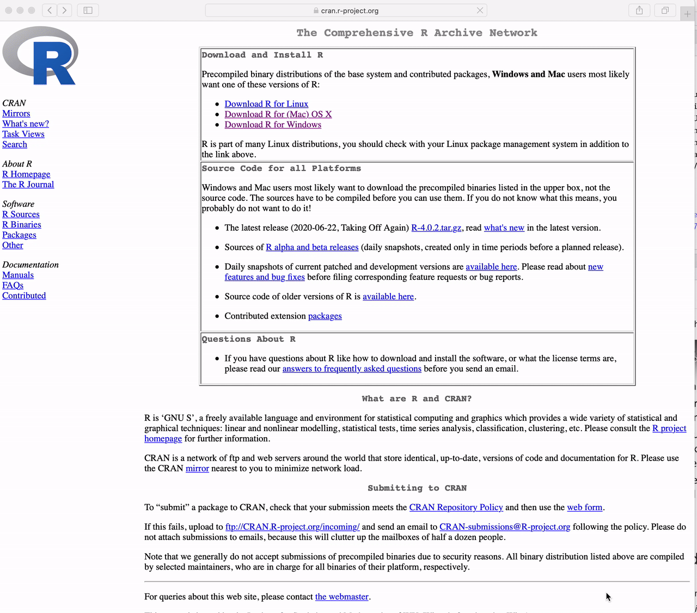

*This lecture, as the rest of the course, is adapted from the version [Stephanie C. Hicks](https://www.stephaniehicks.com/) designed and maintained in 2021 and 2022. Check the recent changes to this file through the `r paste0("[GitHub history](https://github.com/lcolladotor/jhustatcomputing/commits/main/", basename(dirname(getwd())), "/", basename(getwd()), "/index.qmd)")`.*

Welcome! I am very excited to have you in our one-term (i.e. half a semester) course on Statistical Computing course number (140.776) offered by the [Department of Biostatistics](https://publichealth.jhu.edu/departments/biostatistics) at the [Johns Hopkins Bloomberg School of Public Health](https://publichealth.jhu.edu).

<iframe style="border-radius:12px" src="https://open.spotify.com/embed/track/6N4bifNtBKSSDmIL3qZRh8?utm_source=generator" width="100%" height="352" frameBorder="0" allowfullscreen allow="autoplay; clipboard-write; encrypted-media; fullscreen; picture-in-picture" loading="lazy">

</iframe>

<blockquote class="twitter-tweet">

<p lang="en" dir="ltr">

I'm excited to be back this year to teach "140.776 Statistical Computing" at <a href="https://twitter.com/jhubiostat?ref_src=twsrc%5Etfw">@jhubiostat</a> <a href="https://twitter.com/JohnsHopkinsSPH?ref_src=twsrc%5Etfw">@JohnsHopkinsSPH</a> 😊<br><br>This year, I decided to start with some music 🎶. I like part of the lyrics of this song, which talks about overcoming challenges, \[...\]<a href="https://t.co/H5Uq6QhH4D">https://t.co/H5Uq6QhH4D</a><br><br>1/3 🧵 <a href="https://t.co/pkRjefcokc">pic.twitter.com/pkRjefcokc</a>

</p>

— 🇲🇽 Leonardo Collado-Torres (@lcolladotor) <a href="https://twitter.com/lcolladotor/status/1828455658481430960?ref_src=twsrc%5Etfw">August 27, 2024</a>

</blockquote>

```{=html}
<script async src="https://platform.twitter.com/widgets.js" charset="utf-8"></script>
```

<blockquote class="instagram-media" data-instgrm-permalink="https://www.instagram.com/p/DcU7XAZR4sM/?utm_source=ig_embed&amp;utm_campaign=loading" data-instgrm-version="14" style=" background:#FFF; border:0; border-radius:3px; box-shadow:0 0 1px 0 rgba(0,0,0,0.5),0 1px 10px 0 rgba(0,0,0,0.15); margin: 1px; max-width:540px; min-width:326px; padding:0; width:99.375%; width:-webkit-calc(100% - 2px); width:calc(100% - 2px);"><div style="padding:16px;"> <a href="https://www.instagram.com/p/DcU7XAZR4sM/?utm_source=ig_embed&amp;utm_campaign=loading" style=" background:#FFFFFF; line-height:0; padding:0 0; text-align:center; text-decoration:none; width:100%;" target="_blank"> <div style=" display: flex; flex-direction: row; align-items: center;"> <div style="background-color: #F4F4F4; border-radius: 50%; flex-grow: 0; height: 40px; margin-right: 14px; width: 40px;"></div> <div style="display: flex; flex-direction: column; flex-grow: 1; justify-content: center;"> <div style=" background-color: #F4F4F4; border-radius: 4px; flex-grow: 0; height: 14px; margin-bottom: 6px; width: 100px;"></div> <div style=" background-color: #F4F4F4; border-radius: 4px; flex-grow: 0; height: 14px; width: 60px;"></div></div></div><div style="padding: 19% 0;"></div> <div style="display:block; height:50px; margin:0 auto 12px; width:50px;"><svg width="50px" height="50px" viewBox="0 0 60 60" version="1.1" xmlns="https://www.w3.org/2000/svg" xmlns:xlink="https://www.w3.org/1999/xlink"><g stroke="none" stroke-width="1" fill="none" fill-rule="evenodd"><g transform="translate(-511.000000, -20.000000)" fill="#000000"><g><path d="M556.869,30.41 C554.814,30.41 553.148,32.076 553.148,34.131 C553.148,36.186 554.814,37.852 556.869,37.852 C558.924,37.852 560.59,36.186 560.59,34.131 C560.59,32.076 558.924,30.41 556.869,30.41 M541,60.657 C535.114,60.657 530.342,55.887 530.342,50 C530.342,44.114 535.114,39.342 541,39.342 C546.887,39.342 551.658,44.114 551.658,50 C551.658,55.887 546.887,60.657 541,60.657 M541,33.886 C532.1,33.886 524.886,41.1 524.886,50 C524.886,58.899 532.1,66.113 541,66.113 C549.9,66.113 557.115,58.899 557.115,50 C557.115,41.1 549.9,33.886 541,33.886 M565.378,62.101 C565.244,65.022 564.756,66.606 564.346,67.663 C563.803,69.06 563.154,70.057 562.106,71.106 C561.058,72.155 560.06,72.803 558.662,73.347 C557.607,73.757 556.021,74.244 553.102,74.378 C549.944,74.521 548.997,74.552 541,74.552 C533.003,74.552 532.056,74.521 528.898,74.378 C525.979,74.244 524.393,73.757 523.338,73.347 C521.94,72.803 520.942,72.155 519.894,71.106 C518.846,70.057 518.197,69.06 517.654,67.663 C517.244,66.606 516.755,65.022 516.623,62.101 C516.479,58.943 516.448,57.996 516.448,50 C516.448,42.003 516.479,41.056 516.623,37.899 C516.755,34.978 517.244,33.391 517.654,32.338 C518.197,30.938 518.846,29.942 519.894,28.894 C520.942,27.846 521.94,27.196 523.338,26.654 C524.393,26.244 525.979,25.756 528.898,25.623 C532.057,25.479 533.004,25.448 541,25.448 C548.997,25.448 549.943,25.479 553.102,25.623 C556.021,25.756 557.607,26.244 558.662,26.654 C560.06,27.196 561.058,27.846 562.106,28.894 C563.154,29.942 563.803,30.938 564.346,32.338 C564.756,33.391 565.244,34.978 565.378,37.899 C565.522,41.056 565.552,42.003 565.552,50 C565.552,57.996 565.522,58.943 565.378,62.101 M570.82,37.631 C570.674,34.438 570.167,32.258 569.425,30.349 C568.659,28.377 567.633,26.702 565.965,25.035 C564.297,23.368 562.623,22.342 560.652,21.575 C558.743,20.834 556.562,20.326 553.369,20.18 C550.169,20.033 549.148,20 541,20 C532.853,20 531.831,20.033 528.631,20.18 C525.438,20.326 523.257,20.834 521.349,21.575 C519.376,22.342 517.703,23.368 516.035,25.035 C514.368,26.702 513.342,28.377 512.574,30.349 C511.834,32.258 511.326,34.438 511.181,37.631 C511.035,40.831 511,41.851 511,50 C511,58.147 511.035,59.17 511.181,62.369 C511.326,65.562 511.834,67.743 512.574,69.651 C513.342,71.625 514.368,73.296 516.035,74.965 C517.703,76.634 519.376,77.658 521.349,78.425 C523.257,79.167 525.438,79.673 528.631,79.82 C531.831,79.965 532.853,80.001 541,80.001 C549.148,80.001 550.169,79.965 553.369,79.82 C556.562,79.673 558.743,79.167 560.652,78.425 C562.623,77.658 564.297,76.634 565.965,74.965 C567.633,73.296 568.659,71.625 569.425,69.651 C570.167,67.743 570.674,65.562 570.82,62.369 C570.966,59.17 571,58.147 571,50 C571,41.851 570.966,40.831 570.82,37.631"></path></g></g></g></svg></div><div style="padding-top: 8px;"> <div style=" color:#3897f0; font-family:Arial,sans-serif; font-size:14px; font-style:normal; font-weight:550; line-height:18px;">View this post on Instagram</div></div><div style="padding: 12.5% 0;"></div> <div style="display: flex; flex-direction: row; margin-bottom: 14px; align-items: center;"><div> <div style="background-color: #F4F4F4; border-radius: 50%; height: 12.5px; width: 12.5px; transform: translateX(0px) translateY(7px);"></div> <div style="background-color: #F4F4F4; height: 12.5px; transform: rotate(-45deg) translateX(3px) translateY(1px); width: 12.5px; flex-grow: 0; margin-right: 14px; margin-left: 2px;"></div> <div style="background-color: #F4F4F4; border-radius: 50%; height: 12.5px; width: 12.5px; transform: translateX(9px) translateY(-18px);"></div></div><div style="margin-left: 8px;"> <div style=" background-color: #F4F4F4; border-radius: 50%; flex-grow: 0; height: 20px; width: 20px;"></div> <div style=" width: 0; height: 0; border-top: 2px solid transparent; border-left: 6px solid #f4f4f4; border-bottom: 2px solid transparent; transform: translateX(16px) translateY(-4px) rotate(30deg)"></div></div><div style="margin-left: auto;"> <div style=" width: 0px; border-top: 8px solid #F4F4F4; border-right: 8px solid transparent; transform: translateY(16px);"></div> <div style=" background-color: #F4F4F4; flex-grow: 0; height: 12px; width: 16px; transform: translateY(-4px);"></div> <div style=" width: 0; height: 0; border-top: 8px solid #F4F4F4; border-left: 8px solid transparent; transform: translateY(-4px) translateX(8px);"></div></div></div> <div style="display: flex; flex-direction: column; flex-grow: 1; justify-content: center; margin-bottom: 24px;"> <div style=" background-color: #F4F4F4; border-radius: 4px; flex-grow: 0; height: 14px; margin-bottom: 6px; width: 224px;"></div> <div style=" background-color: #F4F4F4; border-radius: 4px; flex-grow: 0; height: 14px; width: 144px;"></div></div></a><p style=" color:#c9c8cd; font-family:Arial,sans-serif; font-size:14px; line-height:17px; margin-bottom:0; margin-top:8px; overflow:hidden; padding:8px 0 7px; text-align:center; text-overflow:ellipsis; white-space:nowrap;"><a href="https://www.instagram.com/p/DcU7XAZR4sM/?utm_source=ig_embed&amp;utm_campaign=loading" style=" color:#c9c8cd; font-family:Arial,sans-serif; font-size:14px; font-style:normal; font-weight:normal; line-height:17px; text-decoration:none;" target="_blank">A post shared by Leonardo Collado Torres (@lcolladotor)</a></p></div></blockquote>
<script async src="//www.instagram.com/embed.js"></script>

This course is designed for ScM and PhD students at Johns Hopkins Bloomberg School of Public Health. I am pretty flexible about permitting outside students, but I want everyone to be aware of the goals and assumptions so no one feels like they are surprised by how the class works.

::: callout-note
The primary goal of the course is to teach you practical programming and computational skills required for the research and application of statistical methods.
:::

This class is not designed to teach the theoretical aspects of statistical or computational methods, but rather the goal is to help with the **practical issues** related to setting up a statistical computing environment for data analyses, developing high-quality R packages, conducting reproducible data analyses, best practices for data visualization and writing code, and creating websites for personal or project use.

### Assumptions and pre-requisites

The course is designed for students in the Johns Hopkins Biostatistics Masters and PhD programs. However, we do not assume a significant background in statistics. Specifically we assume:

#### 1. You know the **basics** of at least one programming language (e.g. R or Python)

-   If it's not R, we assume that you are willing to spend the time to learn R
-   You have heard of things such as control structures, functions, loops, etc
-   Know the difference between different data types (e.g. character, numeric, etc)
-   Know the basics of plotting (e.g. what is a scatterplot, histogram, etc)

#### 2. You know the **basics** of computing environments

-   You have access to a computing environment (i.e. locally on a laptop or working in the cloud)
-   You generally feel comfortable with installing and working with software

#### 3. You know the **basics** of statistics

-   The central dogma (estimates, standard errors, basic distributions, etc.)
-   Key statistical terms and methods
-   Differences between estimation vs testing vs prediction
-   Know how to fit and interpret **basic** statistical models (e.g. linear models)

#### 4. You know the **basics** of reproducible research

-   Difference between replication and reproducible. If not, check this excellent paper by Prasad Patil et al.: <https://doi.org/10.1038/s41562-019-0629-z>.
-   Know how to cite references (e.g. like in a publication)
-   Somewhat familiar with tools that enable reproducible research (In complete transparency, we will briefly cover these topics in the first week, but depending on your comfort level with them, this may impact whether you choose to continue with the course).

Since the target audience for this course is advanced students in statistics we will not be able to spend significant time covering these concepts and technologies. To give you some idea about how these prerequisites will impact your experience in the course, we will be using R for nearly all classes, we will be turning in all assignments via R Markdown documents and you will be encouraged (not required) to use git/GitHub to track changes to your code over time. The majority of the assignments will involve learning the practical issues around performing data analyses, building software packages, building websites, etc all using the R programming language. Data analyses you will perform will also often involve significant data extraction, cleaning, and transformation. We will learn about tools to do all of this, but hopefully most of this sounds familiar to you so you can focus on the concepts we will be teaching around best practices for statistical computing.

::: callout-tip
Some resources that may be useful if you feel you may be missing pieces of this background:

-   **Statistics** - [Mathematical Biostatistics Bootcamp I (Coursera)](https://www.coursera.org/learn/biostatistics); [Mathematical Biostatistics Bootcamp II (Coursera)](https://www.coursera.org/learn/biostatistics-2)
-   **Basic Data Science** - [Cloud Data Science (Leanpub)](https://leanpub.com/universities/set/jhu/cloud-based-data-science); [Data Science Specialization (Coursera)](https://www.coursera.org/specializations/jhu-data-science)
-   **Version Control** - [Github Learning Lab](https://lab.github.com/); [Happy Git and Github for the useR](https://happygitwithr.com/)
-   **Rmarkdown** - [Rmarkdown introduction](https://rmarkdown.rstudio.com/lesson-1.html)
-   **R 101** [*LIBD rstats club*](https://research.libd.org/rstatsclub/) blog post: <https://research.libd.org/rstatsclub/2018/12/24/r_101/>
-   **Introductory R videos** from the [*LIBD rstats club*](https://research.libd.org/rstatsclub/) such as these videos:

<iframe width="560" height="315" src="https://www.youtube.com/embed/T51DRWeuKm8" title="YouTube video player" frameborder="0" allow="accelerometer; autoplay; clipboard-write; encrypted-media; gyroscope; picture-in-picture; web-share" allowfullscreen>

</iframe>

<iframe width="560" height="315" src="https://www.youtube.com/embed/XTuJ8vGnzBU" title="YouTube video player" frameborder="0" allow="accelerometer; autoplay; clipboard-write; encrypted-media; gyroscope; picture-in-picture; web-share" allowfullscreen>

</iframe>
:::

### Getting set up

You must install [R](https://cran.r-project.org) and [Positron](https://positron.posit.co/download.html) (alternatively you can use [RStudio IDE](https://posit.co/products/open-source/rstudio/?sid=1); both are available from [Posit](https://posit.co/)) on your computing environment in order to complete this course.

These are three **different** applications that must be installed separately before they can be used together:

-   `R` is the core underlying programming language and computing engine that we will be learning in this course

-   `Positron` is a new interface for working with `R` developed by [Posit](https://posit.co/) (formerly RStudio). All new features are primarily being implemented in `Positron` and it will be ideal for working for both `R` and `Python`. If you are choosing between `RStudio IDE` and `Positron`, check <https://positron.posit.co/faqs.html#is-rstudio-going-away>.

-   `RStudio IDE` is an interface into `R` that makes many aspects of using and programming `R` simpler.

`R`, `Positron`, and `RStudio IDE` are available for Windows, macOS, and most flavors of Unix and Linux. Please download the version that is suitable for your computing setup.

Throughout the course, we will make use of numerous `R` add-on packages that must be installed over the Internet. Packages can be installed using the `install.packages()` function in `R`. For example, to install the `tidyverse` package, you can run

```{r}
#| eval: false
install.packages("tidyverse")
```

in the `R` console.

We will also be encourage you to use [Git](https://git-scm.com/), following the [*Happy Git and GitHub for the useR*](https://happygitwithr.com/) book, to version control your code. Through the [GitHub Education](https://github.com/education) pack we will get free access to [GitHub Copilot Pro](https://github.com/features/copilot) to help us write code: think about it as an enhanced auto-complete. Alternatively, you can sign up for the 30 day [Posit AI](https://posit.co/products/ai) free trial, or get an account with another AI token provider. Finally, we'll use [Air](https://posit-dev.github.io/air/) for automatically formatting our R code.

#### How to Download R for Windows

Go to <https://cran.r-project.org> and

1.  Click the link to "Download R for Windows"

2.  Click on "base"

3.  Click on "Download R 4.6.1 for Windows"

::: callout-warning
The version in the video is not the latest version of R. Please download the latest version.
:::

{width="80%"}

#### How to Download R for the Mac

Go to <https://cran.r-project.org> and

1.  Click the link to "Download R for (Mac) OS X".

2.  Click on "R-4.6.1-arm64.pkg" (for Apple Silicon Macs)

::: callout-warning
The version in the video is not the latest version of R. Please download the latest version.
:::

{width="80%"}

#### How to Download Positron

Go to <https://posit.co/> and

1.  Click on "Free & Open Source" in the top menu

2.  Click on "Positron" in the drop down menu

3.  Click on "Download Positron" which will take you to <https://positron.posit.co/download.html>

4.  Read the license agreement.

5.  Accept the license agreement.

6.  On the table with all the download options, choose the file that is appropriate for your operating system.

#### How to Download `RStudio IDE`

Go to <https://posit.co/> (formerly <https://rstudio.com>) and

1.  Click on "Free & Open Source" in the top menu

2.  Click on "RStudio IDE" in the drop down menu

3.  Click the button that says "DOWNLOAD RSTUDIO DESKTOP"

4.  Click the button under "Download RStudio" which will take you to <https://posit.co/download/rstudio-desktop/>

5.  Under the section "All Installers and Tarballs" choose the file that is appropriate for your operating system.

::: callout-warning
NOTE: The video shows how to download RStudio for the Mac but you should download RStudio for whatever computing setup you have
:::

{width="80%"}

#### How to Download Git

Install `Git` on your computer following the detailed instructions at <https://happygitwithr.com/install-git>, which will depend on your operating system.

#### Create your GitHub account

Create a personal GitHub account following the instructions at <https://docs.github.com/en/get-started/signing-up-for-github/signing-up-for-a-new-github-account>.

Following [Jeff Leek](https://bsky.app/profile/jtleek.bsky.social)'s advice on [**How to be a modern scientist**](https://leanpub.com/modernscientist) that was part of my team's bootcamps at <https://lcolladotor.github.io/bioc_team_ds/how-to-be-a-modern-scientist.html>, try to choose a username that will be the same one you use on your email and other work-related social media platforms such as Bluesky, LinkedIn, etc.

<iframe width="560" height="315" src="https://www.youtube.com/embed/rcX-VyxHEXA" frameborder="0" allow="accelerometer; autoplay; clipboard-write; encrypted-media; gyroscope; picture-in-picture" allowfullscreen>

</iframe>

If you are using `Positron`, under the "Accounts" options (bottom left corner), click on "Sign in with GitHub \[...\]", provide the 8 digit code, and authorize "posit-dev".

#### How to Apply for GitHub Education and configure GitHub Copilot

Go to <https://github.com/education> and

1.  Click on "Join GitHub education" (likely <https://github.com/settings/education/benefits?locale=en-US>)
2.  Sign in to your GitHub account if you haven't logged in
3.  Click on "Start Application"
4.  There will be a few options to verify that you are a student. One of them is by having a photo of your student ID with dates showing that your student ID is still valid. I've used a screenshot of my Faculty website at <https://publichealth.jhu.edu/faculty/4647/leonardo-collado-torres> when validating my information.
5.  Wait a few days for GitHub to process your application.
6.  Once your application has been approved, If you are using `Positron`, follow the instructions at <https://positron.posit.co/assistant> to enable "Positron assistant". Then under the "Positron Assistant" chat, click on "Add Anthropic as a Chat Provider", then select "GitHub Copilot" and click "Sign in".
    1. Alternatively, you might want to sign up for the 30 day [Posit AI](https://posit.co/products/ai) free trial.
    2. You can pay out of pocket for Claude Anthropic at <https://claude.ai/login> as another option.
7.  If you are using `RStudio IDE` follow the instructions at <https://docs.posit.co/ide/user/ide/guide/tools/copilot.html> to enable `GitHub Copilot` in `RStudio IDE`. I have the "Index project files with GitHub Copilot" checkbox enabled on my preferences.

#### How to get Air (auto-code formatter)

Go to <https://posit-dev.github.io/air/> and

1.  Click on "VS Code and Positron" if you are using `Positron`. That will take you to <https://posit-dev.github.io/air/editor-vscode.html> where some options and configuration steps are described. Note however, that `Air` is already available from `Positron`. You will need to open your `settings.json` file from the Command Palette (`Shift + Cmd + P` on Mac/Linux, `Shift + Ctrl + P` on Windows):

    -   Run `Preferences: Open Workspace Settings (JSON)` to modify workspace specific settings (recommended).

    -   Run `Preferences: Open User Settings (JSON)` to modify global user settings (preferred option if you are not working with code from others). Then edit your `settings.json` with the relevant lines about R code formatting and `Air` as shown below:

        ```{json}
        {
            "files.associations": {
                "renv.lock": "json"
            },
            "positron.assistant.gitIntegration.enable": true,
            "positron.assistant.showTokenUsage.enable": true,
            "positron.assistant.toolDetails.enable": true,
            "[r]": {
                "editor.formatOnSave": true,
                "editor.defaultFormatter": "Posit.air-vscode"
            }
        }
        ```

    -  You can also configure a few options at [positron://settings/air.dependencyLogLevels](positron://settings/air.dependencyLogLevels) and related settings.

2.  Click on "RStudio" if you are using `RStudio IDE`. That will take you to <https://posit-dev.github.io/air/editor-rstudio.html> where you will find the detailed installation instructions.

    -   Note that I recommend enabling the `Tools -> Global Options -> Code -> Saving` and check `Reformat documents on save` option. Particularly if you are working on your own code.

# Learning Objectives

The goal is by the end of the class, students will be able to:

1.  Install and configure software necessary for a statistical programming environment
2.  Discuss generic programming language concepts as they are implemented in a high-level statistical language
3.  Write and debug code in `R` using `tidyverse` packages (and integrate code from `Python` modules)
4.  Build basic data visualizations using `R` and the `tidyverse`
5.  Discuss best practices for coding and reproducible research, basics of data ethics, basics of working with special data types, and basics of storing data
    -   Example of why keeping track of R versions is important: <https://github.com/edward130603/BayesSpace/issues/150>.

# Course logistics

The only option is to take the course is in-person (140.776.01).

-   <https://lcolladotor.github.io/jhustatcomputing>

All communication for the course is going to take place on one of three platforms:

-   **Courseplus**: for discussion, sharing resources, collaborating, and announcements

    -   Important for practicing written communication in the context of asking for help with R

-   **Github**: for getting access to course materials (e.g. lectures, project assignments)

    -   Course Github: <https://github.com/lcolladotor/jhustatcomputing>

-   **Lectures**: lectures will be in person

    -   All in person lectures to be recorded and posted online after class ends
    -   If for some reason I am sick or not capable of coming onsite, I will send out a Zoom link for everyone to attend remotely for that day.

The primary communication for the class will go through Courseplus. That is where we will post course announcements, answer common questions, and as the primary means of communication between course participants and course instructors.

::: callout-important
If you are registered for the course, you should have access to Courseplus now. Once you have access you will also be able to find all material and dates/times of drop-in hours. Any Zoom links will be posted on Courseplus.
:::

### Course Staff

The course instructor this year is [Leonardo Collado Torres](http://lcolladotor.github.io/) who is an Investigator at the [Lieber Institute for Brain Development](https://www.libd.org/) and an Assistant Professor in the [Department of Biostatistics](https://publichealth.jhu.edu/departments/biostatistics) at the [Johns Hopkins Bloomberg School of Public Health](https://publichealth.jhu.edu). I was actually a student of this course in Fall 2012 when [Roger D. Peng](https://bsky.app/profile/rdpeng.org) was the instructor of this course and [Jenna Krall](https://bsky.app/profile/kralljr.bsky.social) was the only teaching assistant. I first taught this course in 2023. I myself started learning and [teaching](http://lcolladotor.github.io/#teaching) about R in 2008 and we have a lot of material in the [LIBD rstats club](https://research.libd.org/rstatsclub/) that you might be interested in.

At the Lieber Institute for Brain Development ([LIBD](https://www.libd.org/)), my group works on understanding the roots and signatures of disease (particularly psychiatric disorders) by zooming in across dimensions of gene activity. We achieve this by studying gene expression at all expression feature levels (genes, exons, exon-exon junctions, and un-annotated regions) and by using different gene expression measurement technologies (bulk RNA-seq, single cell/nucleus RNA-seq, and spatial transcriptomics) that provide finer biological resolution and localization of gene expression. We work closely with collaborators from LIBD as well as from Johns Hopkins University (JHU) and other institutions, which reflects the cross-disciplinary approach and diversity in expertise needed to further advance our understanding of high throughput biology.

Some weeks I use [R](http://cran.r-project.org/) and [Bioconductor](http://www.bioconductor.org/), and on some days I [write R packages](https://lcolladotor.github.io/pkgs/). Occasionally I write [blog posts](http://lcolladotor.github.io/#blog) about them and other tools. I'm a co-founder of the [LIBD rstats club](http://LieberInstitute.github.io/rstatsclub/) and the [CDSB community](https://comunidadbioinfo.github.io) of R and Bioconductor developers in Mexico and Latin America, that we described at the [R Consortium website](https://www.r-consortium.org/blog/2020/03/18/cdsb-diversity-and-outreach-hotspot-in-mexico). In the past, I also served on the [Bioconductor Community Advisory Board](http://bioconductor.org/about/community-advisory-board/).

If you want, you can find me on [Bluesky](https://bsky.app/profile/lcolladotor.bsky.social), [LinkedIn](https://www.linkedin.com/in/lcollado/), among other places.

#### Teaching Assistants

We also have two amazing TAs this year:

-   Lidio Jaimes Jr ([ljaimes1\@jh.edu](mailto:ljaimes1@jh.edu)): I am a second-year Biostatistics ScM student. My primary research interest is aging, particularly cognitive aging and Alzheimer's disease, and I am currently working on methods for addressing attrition. During my free time, I enjoy traveling, watching documentaries, and keeping up with sports (soccer and college football). 
-   Bella Satpathy-Horton ([ghorton2\@jhmi.edu](mailto:ghorton2@jhmi.edu)). I am an MD-PhD student in my third year of the PhD in Biostatistics. My research focuses on extracting latent structures across different data sets to improve phenotyping and risk prediction, with applications to chronic pain and substance use. In my free time, I'm mostly hanging out with my two dogs, but also enjoy puzzles and board games. 

### Assignment Due Dates

All course assignment due dates appear on the **Schedule** and **Syllabus**.

### Grading

#### Philosophy

We believe the purpose of graduate education is to train you to be able to think for yourself and initiate and complete your own projects. We are super excited to talk to you about ideas, work out solutions with you, and help you to figure out how to produce professional data analyses. We do not think that graduate school grades are important for this purpose. This means that we do not care very much about graduate student grades.

That being said, we have to give you a grade so they will be:

-   A - Excellent - 90%+
-   B - Passing - 80%+
-   C - Needs improvement - 70%+

We rarely give out grades below a C and if you consistently submit work, and do your best you are very likely to get an A or a B in the course.

When I was a JHBSPH student in 2011-2016, I had a scholarship from my country 🇲🇽 which had specific grade requirements, so I recognize that while most employers won't care about your grades over your grad school projects, you might have strong reasons for aiming for high grades.

#### Relative weights

The grades are based on three projects (plus one entirely optional project to help you get set up). The breakdown of grading will be

-   33% for Project 1
-   33% for Project 2
-   34% for Project 3

If you submit an project solution, it is your own work, and it meets a basic level of completeness and effort you will get 100% for that project. If you submit a project solution, but it doesn't meet basic completeness and effort you will receive 50%. If you do not submit an solution you will receive 0%.

### Submitting assignments

Please write up your project solutions using R Markdown. In some cases, you will compile a R Markdown file into an HTML file and submit your HTML file to the dropbox on Courseplus. In other cases, you may create an R package or website. In all of the above, when applicable, show all your code and provide as much explanation / documentation as you can.

For each project, we will provide a time when we download the materials. We will assume whatever version we download at that time is what you are turning in.

### Reproducibility

We will talk about reproducibility a bit during class, and it will be a part of the homework assignments as well. Reproducibility of scientific code is very challenging, so the faculty and TAs completely understand difficulties that arise. But we think that it is important that you practice reproducible research. In particular, your project assignments should perform the tasks that you are asked to do and create the figures and tables you are asked to make as a part of the compilation of your document. We will have some pointers for some issues that have come up as we announce the projects.

### Code of Conduct

We are committed to providing a welcoming, inclusive, and harassment-free experience for everyone, regardless of gender, gender identity and expression, age, sexual orientation, disability, physical appearance, body size, race, ethnicity, religion (or lack thereof), political beliefs/leanings, or technology choices. We do not tolerate harassment of course participants in any form. Sexual language and imagery is not appropriate for any work event, including group meetings, conferences, talks, parties, Twitter, and other online media. This code of conduct applies to all course participants, including instructors and TAs, and applies to all modes of interaction, both in-person and online, including GitHub project repos, Slack channels, and Twitter.

I was also part of the Bioconductor Code of Conduct committee for a few years. You might find the Bioconductor Code of Conduct useful as it is translated into different languages by native speakers of said languages: <https://bioconductor.github.io/bioc_coc_multilingual/>.

Course participants violating these rules will be referred to leadership of the Department of Biostatistics and the Title IX coordinator at JHU and may face expulsion from the class.

All class participants agree to:

-   **Be considerate** in speech and actions, and actively seek to acknowledge and respect the boundaries of other members.
-   **Be respectful**. Disagreements happen, but do not require poor behavior or poor manners. Frustration is inevitable, but it should never turn into a personal attack. A community where people feel uncomfortable or threatened is not a productive one. Course participants should be respectful both of the other course participants and those outside the course.
-   **Refrain from demeaning, discriminatory, or harassing behavior and speech**. Harassment includes, but is not limited to: deliberate intimidation; stalking; unwanted photography or recording; sustained or willful disruption of talks or other events; inappropriate physical contact; use of sexual or discriminatory imagery, comments, or jokes; and unwelcome sexual attention. If you feel that someone has harassed you or otherwise treated you inappropriately, please alert Leonardo Collado Torres.
-   **Take care of each other**. Refrain from advocating for, or encouraging, any of the above behavior. And, if someone asks you to stop, then stop. Alert Leonardo Collado Torres if you notice a dangerous situation, someone in distress, or violations of this code of conduct, even if they seem inconsequential.

### Need Help?

Please speak with Leonardo Collado Torres or one of the TAs. You can also reach out to Elizabeth Stuart, chair of the department of Biostatistics or Margaret Taub, Ombudsman for the Department of Biostatistics.

You may also reach out to any Hopkins resource for sexual harassment, discrimination, or misconduct:

-   JHU Sexual Assault Helpline, 410-516-7333 (confidential)
-   [University Sexual Assault Response and Prevention website](http://sexualassault.jhu.edu/?utm_source=JHU+Broadcast+Messages+-+Synced+List&utm_campaign=c9030551f7-EMAIL_CAMPAIGN_2017_12_11&utm_medium=email&utm_term=0_af6859b027-c9030551f7-69248741)
-   [Johns Hopkins Compliance Hotline](https://johnshopkinsspeak2us.tnwreports.com/?utm_source=JHU+Broadcast+Messages+-+Synced+List&utm_campaign=c9030551f7-EMAIL_CAMPAIGN_2017_12_11&utm_medium=email&utm_term=0_af6859b027-c9030551f7-69248741), 844-SPEAK2US (844-733-2528)
-   [Hopkins Policies Online](https://jhu.us5.list-manage.com/track/click?u=bd75ef1a5cad0cbfd522412c4&id=8a667a12dd&e=b1124f7c17)
-   [JHU Office of Institutional Equity](https://jhu.us5.list-manage.com/track/click?u=bd75ef1a5cad0cbfd522412c4&id=928bcfb8a9&e=b1124f7c17) 410-516-8075 (nonconfidential)
-   [Johns Hopkins Student Assistance Program](https://jhu.us5.list-manage.com/track/click?u=bd75ef1a5cad0cbfd522412c4&id=98f4091f97&e=b1124f7c17) (JHSAP), 443-287-7000
-   [University Health Services](https://jhu.us5.list-manage.com/track/click?u=bd75ef1a5cad0cbfd522412c4&id=d51077694c&e=b1124f7c17), 410-955-1892
-   [The Faculty and Staff Assistance Program](https://jhu.us5.list-manage.com/track/click?u=bd75ef1a5cad0cbfd522412c4&id=af1f20bd97&e=b1124f7c17) (FASAP), 443-997-7000

### Feedback

We welcome feedback on this Code of Conduct.

### License and attribution

This Code of Conduct is distributed under a Attribution-NonCommercial-ShareAlike 4.0 International (CC BY-NC-SA 4.0) license. Portions of above text comprised of language from the Codes of Conduct adopted by rOpenSci and Django, which are licensed by CC BY-SA 4.0 and CC BY 3.0. This work was further inspired by Ada Initiative's ''how to design a code of conduct for your community'' and Geek Feminism's Code of conduct evaluations and expanded by Ashley Johnson and Shannon Ellis in the Jeff Leek group.

### Academic Ethics

Students enrolled in the Bloomberg School of Public Health of The Johns Hopkins University assume an obligation to conduct themselves in a manner appropriate to the University's mission as an institution of higher education. A student is obligated to refrain from acts which he or she knows, or under the circumstances has reason to know, impair the academic integrity of the University. Violations of academic integrity include, but are not limited to: cheating; plagiarism; knowingly furnishing false information to any agent of the University for inclusion in the academic record; violation of the rights and welfare of animal or human subjects in research; and misconduct as a member of either School or University committees or recognized groups or organizations.

Students should be familiar with the policies and procedures specified under Policy and Procedure Manual Student-01 (Academic Ethics), available on the school's [portal](https://my.jhsph.edu/Pages/Faculty.aspx).

The faculty, staff and students of the Bloomberg School of Public Health and the Johns Hopkins University have the shared responsibility to conduct themselves in a manner that upholds the law and respects the rights of others. Students enrolled in the School are subject to the Student Conduct Code (detailed in Policy and Procedure Manual Student-06) and assume an obligation to conduct themselves in a manner which upholds the law and respects the rights of others. They are responsible for maintaining the academic integrity of the institution and for preserving an environment conducive to the safe pursuit of the School's educational, research, and professional practice missions.

## Disability Support Service

Students requiring accommodations for disabilities should register with [Student Disability Service (SDS)](https://publichealth.jhu.edu/about/inclusion-diversity-anti-racism-and-equity-idare/student-disability-services). It is the responsibility of the student to register for accommodations with SDS. Accommodations take effect upon approval and apply to the remainder of the time for which a student is registered and enrolled at the Bloomberg School of Public Health. Once you are f a student in your class has approved accommodations you will receive formal notification and the student will be encouraged to reach out. If you have questions about requesting accommodations, please contact `BSPH.dss@jhu.edu`.

## Previous versions of the class

-   <https://www.stephaniehicks.com/jhustatcomputing2022>
-   <https://www.stephaniehicks.com/jhustatcomputing2021>
-   <https://rdpeng.github.io/Biostat776>

## Typos and corrections

Feel free to submit typos/errors/etc via the GitHub repository associated with the class: <https://github.com/lcolladotor/jhustatcomputing/issues>. You will have the thanks of your grateful instructor!

# R session information

```{r}
options(width = 120)
sessioninfo::session_info()
```
